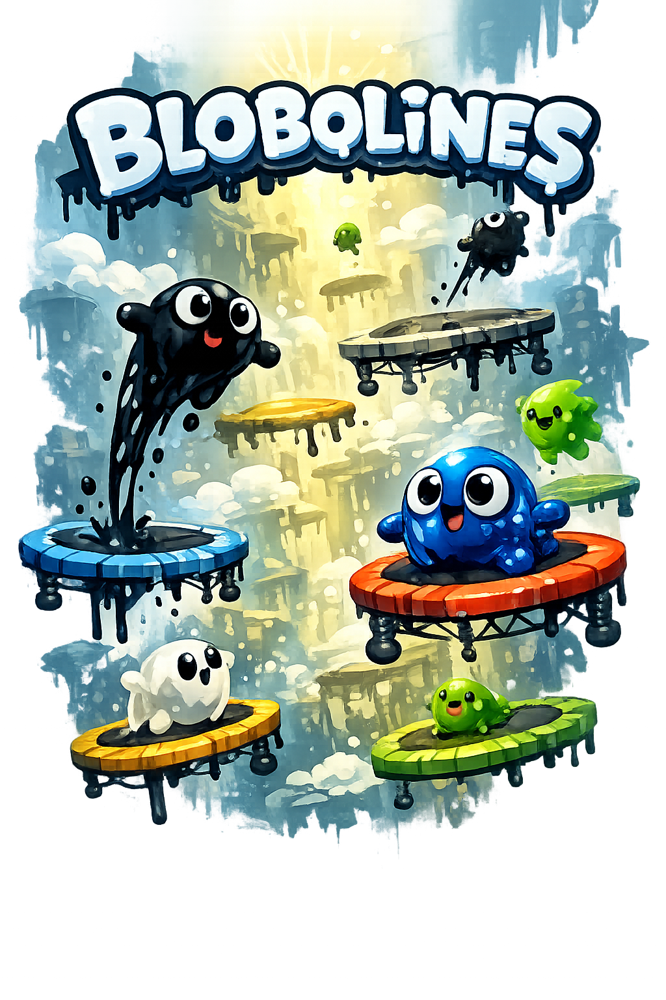

<p align="center">
  
</p>

<h1 align="center">Blobolines</h1>

<p align="center">
  Launch a squishy gel blob through endless soft cloud pads — a World-of-Goo-flavored
  vertical-launch physics arcade game. Hold to charge cloud catches, steer in mid-air,
  and leave big colorful splats all the way up.
</p>

<p align="center">
  <a href="https://jbcom.github.io/blobolines/"><b>▶ Play (web)</b></a> ·
  Android APK on each <a href="https://github.com/jbcom/blobolines/releases">release</a>
</p>

---

## What it is

A vertical climber built around **gooey, deformable blobs** and **soft cloud
catches**. Hold on Blobby to charge the next launch, release to fly, and
drag in the air to steer in full 3D. Land clean cloud catches to build a combo, grab
crystals and power-ups, and climb as high as you can — while your blob squashes,
stretches, blinks, and splatters along the way.

## Stack

React Three Fiber + drei + @react-three/rapier (physics) · `postprocessing` (soft
glow) · Howler.js (sample-based audio) · shadcn/ui (Radix) + Motion ·
Tailwind v4 · Vite 8 · TypeScript · Capacitor (Android) · Vitest + Playwright. See
[`docs/ARCHITECTURE.md`](docs/ARCHITECTURE.md).

## Develop

```sh
pnpm install
pnpm dev            # http://localhost:5173
pnpm test           # unit (happy-dom)
pnpm test:browser   # visual fixtures (Chromium + WebGL)
pnpm build          # tsc + vite build
pnpm android:debug  # build + sync Capacitor + assemble debug APK
```

## Docs

- [Architecture](docs/ARCHITECTURE.md) — package map, boundaries, data flow
- [Game design](docs/GAME-DESIGN.md) — mechanics, physics constants, tuning
- [Design language](docs/DESIGN.md) — tokens, typography, the blob identity
- [Testing](docs/TESTING.md) · [Deployment](docs/DEPLOYMENT.md)
- [`AGENTS.md`](AGENTS.md) — operating protocols for AI contributors

## License

[MIT](LICENSE) © Jon Bogaty
